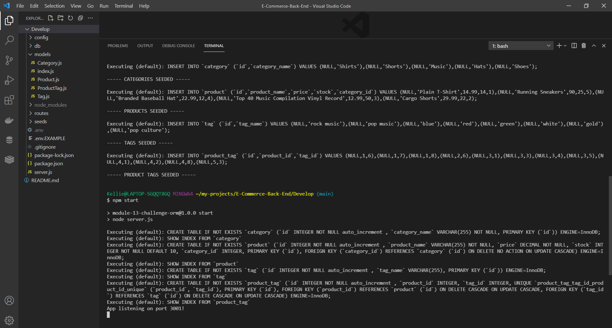
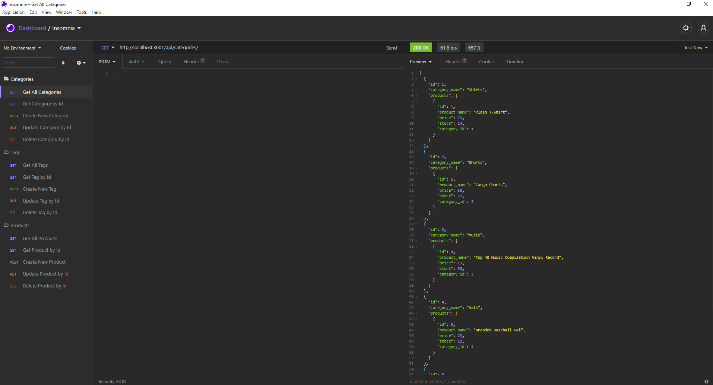

# E-Commerce Back End

## Description
This is a fun E-Commerce App that allows a user to View, Create, Update and Delete their Products, Categories and Tags

## Insructions

* Clone the Repository
* Update .env.EXAMPLE with your own database server password and user name (usually "root" for MYSQL) and then save and rename the file to .env
* Open up your terminal and change into the cloned folder
* Type "npm i" to install the dependancies
* Type "mysql -u root -p" and then enter your MYSQL password
* Type "source db/schema.sql" to create the database
* After the database is created type "quit" to exit out of the MYSQL terminal command
* Type "npm run seed" to fill the database
* Then lastly type "npm start" to start the server

## Screenshots

* Screenshot of the Terminal after set up! 

* Screenshot of Insomnia Core in action

## Links

* Github: https://github.com/Kel03-byte/E-Commerce-Back-End

* How to create and populate the database, and then start the server!
[Video Link](https://drive.google.com/file/d/11ILlenr6gVwzAHm5AQN_j4nIOG6MSdt_/view?usp=sharing)

* Insomnia Core Walkthrough on how to View, Create, Update and Delete a Product, Tag and Category!
[Video Link](https://drive.google.com/file/d/1XPcIPeH5icZPvAZzIHhkQTBEQX30D7o7/view?usp=sharing)